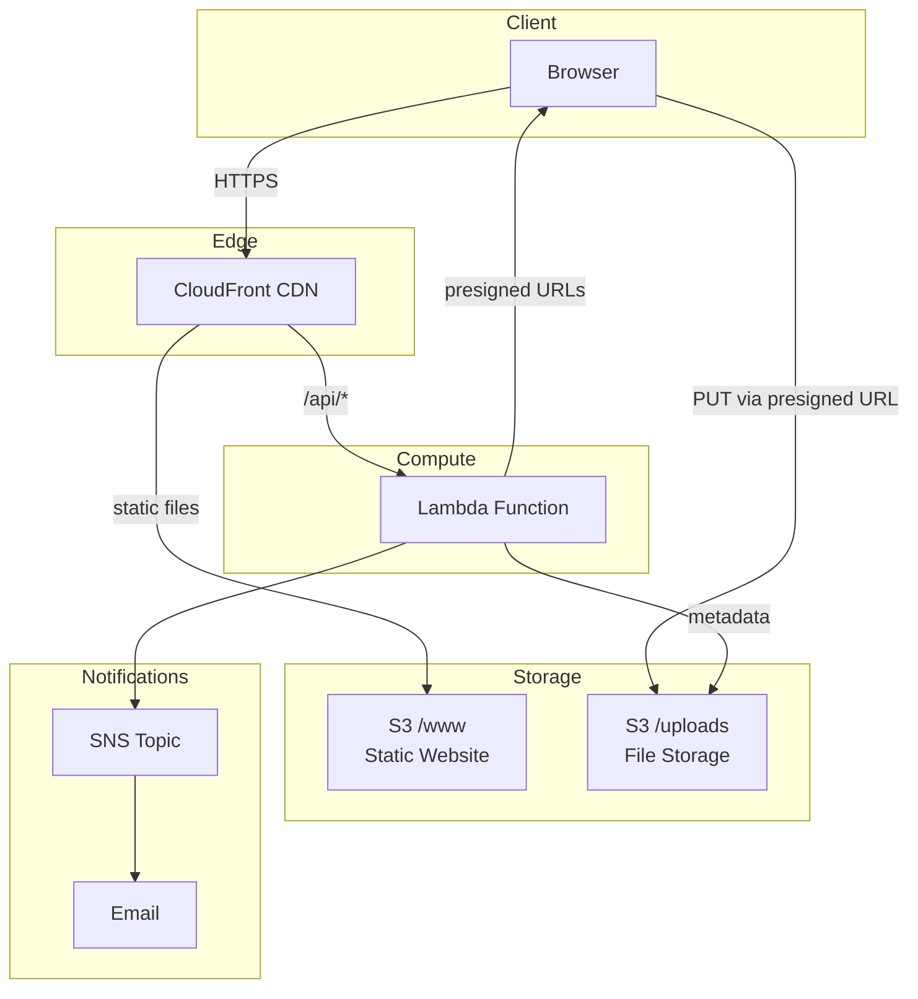
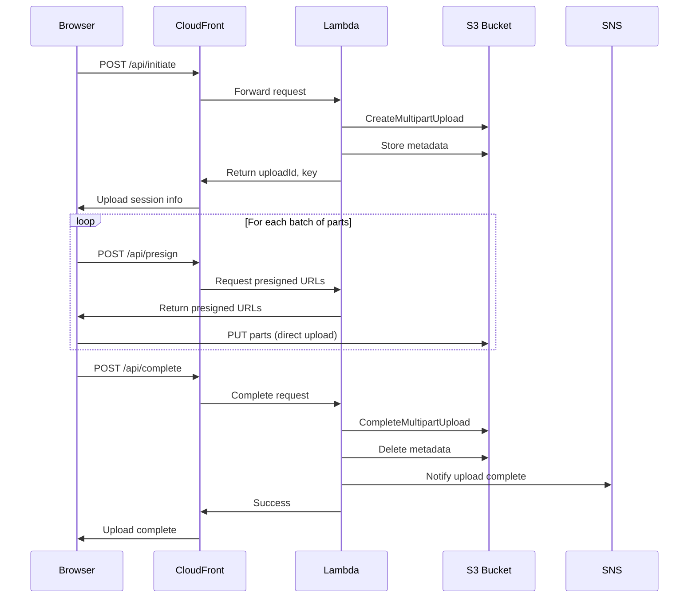

# Secure File Drop

A minimal, serverless file upload system built on AWS. Supports files up to 5TB using S3 multipart uploads with email notifications.

## Architecture



### Request Flow



### Components

| Component | Purpose | Cost Model |
|-----------|---------|------------|
| **CloudFront** | CDN, HTTPS termination | Free tier: 1TB data transfer + 10M requests/month |
| **Lambda Function URL** | API endpoint | Pay per request (~$0.20/100K) |
| **S3** | File storage + static hosting | Pay per GB stored + requests |
| **SNS** | Email notifications | First 1000 emails free |

## Features

- **Large file support**: Up to 5TB using S3 multipart uploads
- **Resume capability**: Detect and resume incomplete uploads
- **Progress tracking**: Real-time upload progress with speed calculation
- **Email notifications**: Automated alerts on upload completion
- **Accessible**: ARIA compliant with screen reader support
- **Secure**: CSP headers, input validation, path traversal prevention
- **Observable**: CloudWatch alarms, structured logging, request tracing

## Prerequisites

- Node.js 22+ (Lambda runtime uses Node.js 22.x)
- AWS CLI configured with credentials
- AWS CDK CLI (`npm install -g aws-cdk`)

## Quick Start

```bash
# Install dependencies
npm install

# Run tests
npm test                    # Backend tests
npm run test:frontend       # Frontend tests
npm run test:all            # Both

# Deploy to AWS (builds frontend, cleans cache, deploys)
npm run deploy -- -c notificationEmail=your@email.com

# After deployment, confirm the SNS subscription in your email
```

## Deployment Options

### Basic Deployment

```bash
npm run deploy -- -c notificationEmail=your@email.com
```

This builds the frontend, cleans the CDK cache, and deploys using CloudFront's pay-as-you-go pricing (1TB data transfer + 10M requests/month free tier).

### With Reserved Concurrency (Optional)

To limit Lambda concurrency (cost protection, DoS mitigation):

```bash
# Requires account concurrency quota >= 110
# Check quota: AWS Console > Service Quotas > Lambda > Concurrent executions
npm run deploy -- \
  -c notificationEmail=your@email.com \
  -c reservedConcurrency=10
```

> **Note**: AWS requires 100 unreserved concurrent executions per account. New accounts often have only 10 total quota, so reserved concurrency is disabled by default. [Request a quota increase](https://docs.aws.amazon.com/lambda/latest/dg/configuration-concurrency.html) if needed.

### Stack Outputs

After deployment, you'll see:

| Output | Description |
|--------|-------------|
| `WebsiteUrl` | CloudFront URL for the upload page |
| `LambdaFunctionUrl` | Direct Lambda endpoint (bypasses CloudFront) |
| `BucketName` | S3 bucket name |
| `SnsTopicArn` | SNS topic for notifications |
| `CloudFrontDistributionId` | For cache invalidation |

## Testing

### Unit Tests

```bash
# Backend (Lambda)
npm test
npm run test:coverage

# Frontend
npm run test:frontend
npm run test:frontend:coverage

# All tests
npm run test:all
```

### Integration Tests

```bash
# Against deployed stack
./scripts/integration-test.sh https://your-cloudfront-url.cloudfront.net
```

### CI/CD Integration Tests

The GitHub Actions workflow includes automated integration tests that run on pushes to `main`. To enable them:

1. **Deploy the stack** to your AWS account
2. **Configure GitHub repository secrets**:

   | Secret | Description | Example |
   |--------|-------------|---------|
   | `CLOUDFRONT_URL` | Your deployed CloudFront URL | `https://d1234abcd.cloudfront.net` |
   | `AWS_ACCESS_KEY_ID` | AWS credentials for test execution | `AKIA...` |
   | `AWS_SECRET_ACCESS_KEY` | AWS secret key | `wJalr...` |
   | `AWS_REGION` | AWS region | `us-east-1` |

3. **Create a GitHub environment** named `production` (optional, for approval gates)

Once configured, integration tests will automatically run after successful builds on the `main` branch. If `CLOUDFRONT_URL` is not configured, tests are skipped gracefully.

## Project Structure

```
secure-file-drop/
├── bin/                      # CDK app entry point
│   └── secure-file-drop.ts
├── lib/                      # CDK infrastructure
│   └── secure-file-drop-stack.ts
├── lambda/                   # Backend Lambda
│   ├── handler.ts            # API implementation
│   └── __tests__/            # Lambda unit tests
├── frontend/                 # Vite + TypeScript SPA
│   ├── src/
│   │   ├── main.ts           # Frontend application
│   │   └── __tests__/        # Frontend unit tests
│   ├── index.html
│   └── styles.css
├── shared/                   # Shared types & utilities
│   └── index.ts
├── scripts/
│   └── integration-test.sh   # Integration test runner
├── SECURITY.md               # Security documentation
├── package.json
└── README.md
```

## API Reference

All endpoints accept POST requests with JSON body.

### POST /api/initiate

Start a new multipart upload.

**Request:**
```json
{
  "email": "user@example.com",
  "fileName": "document.pdf",
  "fileSize": 104857600,
  "contentType": "application/pdf",
  "title": "Project Files",
  "description": "Q4 deliverables"
}
```

**Response:**
```json
{
  "submissionId": "550e8400-e29b-41d4-a716-446655440000",
  "uploadId": "s3-multipart-upload-id",
  "key": "uploads/550e8400.../document.pdf",
  "totalParts": 2,
  "chunkSize": 67108864
}
```

### POST /api/presign

Get presigned URLs for uploading parts.

**Request:**
```json
{
  "uploadId": "s3-multipart-upload-id",
  "key": "uploads/550e8400.../document.pdf",
  "partNumbers": [1, 2, 3]
}
```

**Response:**
```json
{
  "urls": [
    { "partNumber": 1, "url": "https://bucket.s3.amazonaws.com/...?X-Amz-..." },
    { "partNumber": 2, "url": "https://bucket.s3.amazonaws.com/...?X-Amz-..." }
  ]
}
```

### POST /api/complete

Finalize the multipart upload.

**Request:**
```json
{
  "uploadId": "s3-multipart-upload-id",
  "key": "uploads/550e8400.../document.pdf",
  "parts": [
    { "PartNumber": 1, "ETag": "\"abc123...\"" },
    { "PartNumber": 2, "ETag": "\"def456...\"" }
  ],
  "submissionId": "550e8400-e29b-41d4-a716-446655440000"
}
```

**Response:**
```json
{
  "success": true,
  "message": "Upload completed successfully",
  "notificationSent": true
}
```

**Note**: `notificationSent` indicates whether the email notification was successfully sent. The upload is complete regardless of notification status.

### POST /api/abort

Cancel an in-progress upload.

**Request:**
```json
{
  "uploadId": "s3-multipart-upload-id",
  "key": "uploads/550e8400.../document.pdf",
  "submissionId": "550e8400-e29b-41d4-a716-446655440000"
}
```

### POST /api/status

Check upload progress (for resume).

**Request:**
```json
{
  "uploadId": "s3-multipart-upload-id",
  "key": "uploads/550e8400.../document.pdf"
}
```

**Response:**
```json
{
  "completedParts": [
    { "partNumber": 1, "etag": "\"abc123\"", "size": 67108864 }
  ],
  "totalParts": 1
}
```

### POST /api/health

Health check endpoint.

**Response:**
```json
{
  "status": "healthy",
  "timestamp": "2024-01-01T00:00:00.000Z",
  "requestId": "550e8400-e29b-41d4-a716-446655440000"
}
```

## Configuration

### Environment Variables (Lambda)

| Variable | Description | Default |
|----------|-------------|---------|
| `BUCKET_NAME` | S3 bucket name | (from CDK) |
| `SNS_TOPIC_ARN` | Notification topic | (from CDK) |
| `CHUNK_SIZE` | Part size in bytes | 67108864 (64MB) |

### Frontend Constants

| Constant | Value | Description |
|----------|-------|-------------|
| `CONCURRENT_UPLOADS` | 5 | Parallel part uploads |
| `PRESIGN_BATCH_SIZE` | 10 | URLs per presign request |

## Monitoring

### CloudWatch Alarms

The stack creates these alarms (notifications sent to the same SNS topic):

| Alarm | Threshold | Description |
|-------|-----------|-------------|
| Lambda Errors | 5/5min | API failure rate |
| Lambda Throttles | 1/5min | Capacity issues |
| Lambda Duration | p99 > 25s | Approaching timeout |
| CloudFront 5xx | 5% | Origin failures |

### Structured Logging

Lambda logs are JSON-formatted for CloudWatch Logs Insights:

```sql
-- Find all requests for a submission
fields @timestamp, level, message, submissionId
| filter submissionId = 'YOUR-SUBMISSION-ID'
| sort @timestamp asc

-- Error summary
fields @timestamp, message, requestId
| filter level = 'ERROR'
| stats count() by message
```

## Security

See [SECURITY.md](./SECURITY.md) for comprehensive security documentation.

### Highlights

- **Input validation**: Zod schemas for all API inputs
- **Path traversal prevention**: Filename sanitization
- **CSP headers**: Strict Content Security Policy
- **S3 security**: Block Public Access, SSL enforcement, OAC
- **Request tracing**: X-Request-Id header on all responses

## Cost Estimate

For low-to-medium volume usage (pay-as-you-go pricing):

| Service | Usage | Monthly Cost |
|---------|-------|--------------|
| CloudFront | Free tier (1TB transfer, 10M requests) | $0 |
| Lambda | 100K invocations | ~$0.20 |
| S3 Storage | 100GB | ~$2.30 |
| S3 Requests | 10K each | ~$0.05 |
| SNS | 1000 emails | ~$0.10 |
| CloudWatch Logs | 5GB ingested | ~$2.50 |
| **Total** | | **~$5.15** |

**Notes**:
- CloudFront pay-as-you-go free tier: 1TB data transfer + 10M requests/month (always free)
- CloudWatch Logs cost scales with upload volume; enable retention policies to control costs
- Beyond free tier, pay-as-you-go charges apply (see [CloudFront pricing](https://aws.amazon.com/cloudfront/pricing/))

## Development

```bash
# Install dependencies
npm install

# Start frontend dev server
npm run dev:frontend

# Watch mode for CDK/Lambda
npm run watch

# Format check (if prettier configured)
npm run lint
```

## Troubleshooting

### Deployment fails with "already exists" errors

If deployment fails and you see errors like:
```
Resource of type 'AWS::CloudFront::OriginAccessControl' with identifier '...' already exists
```

This happens when a previous deployment failed mid-way and CloudFormation rollback didn't clean up all resources. Fix it by:

1. **Delete the failed stack** (if in ROLLBACK_COMPLETE state):
   ```bash
   aws cloudformation delete-stack --stack-name SecureFileDropStack
   ```

2. **Find and delete orphaned OACs**:
   ```bash
   # List OACs
   aws cloudfront list-origin-access-controls

   # Get ETag for deletion
   aws cloudfront get-origin-access-control --id <OAC_ID>

   # Delete with ETag
   aws cloudfront delete-origin-access-control --id <OAC_ID> --if-match <ETAG>
   ```

3. **Retry deployment**:
   ```bash
   npm run deploy -- -c notificationEmail=your@email.com
   ```

### Upload fails immediately

1. Check browser console for errors
2. Verify CloudFront URL is correct
3. Check Lambda logs in CloudWatch

### Resume not working

1. Verify localStorage contains saved state
2. Check /api/status endpoint response
3. File name and size must match exactly

### Notifications not received

1. Confirm SNS subscription (check email)
2. Check SNS delivery logs
3. Verify spam folder

## License

MIT
