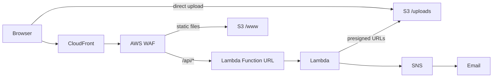

# Secure File Drop

A simple, serverless file upload system built on AWS. Supports files up to 5TB using S3 multipart uploads with email notifications.

## Architecture



**Components:**
- **CloudFront** - CDN with Free flat-rate plan (includes WAF, DDoS protection)
- **AWS WAF** - Web Application Firewall (included in Free plan)
- **Lambda Function URL** - Direct HTTP endpoint (no API Gateway)
- **S3** - Stores static website (`/www`) and uploads (`/uploads`)
- **SNS** - Email notifications on upload start/complete

## Prerequisites

- Node.js 20+
- AWS CLI configured with credentials
- AWS CDK CLI (`npm install -g aws-cdk`)

## Deployment

```bash
# Install dependencies
npm install

# Deploy to AWS (first time - provide notification email)
npx cdk deploy -c notificationEmail=your@email.com --profile <your-profile>

# Subsequent deploys (email is stored in cdk.context.json)
npx cdk deploy --profile <your-profile>
```

**After first deployment:**
1. Check your email for an SNS subscription confirmation
2. Click the confirmation link to enable notifications

**Stack outputs:**
- `WebsiteUrl` - CloudFront URL to access the upload page
- `LambdaFunctionUrl` - Direct Lambda endpoint
- `BucketName` - S3 bucket name (auto-generated for security)
- `SnsTopicArn` - SNS topic for notifications

## Configuration

**Required parameters (first deploy):**

| Parameter | How to Set | Description |
|-----------|------------|-------------|
| `notificationEmail` | `-c notificationEmail=your@email.com` | Email for upload notifications |

**Optional customization** in `lib/secure-file-drop-stack.ts`:

| Setting | Location | Default |
|---------|----------|---------|
| Chunk size | Lambda environment `CHUNK_SIZE` | 64MB |
| Multipart cleanup | `abortIncompleteMultipartUploadAfter` | 7 days |

**Note:** CloudFront Free flat-rate plan does not allow custom price class configuration.

## How It Works

1. User selects a file and enters their email
2. Frontend calls `/api/initiate` to start multipart upload
3. Lambda creates the upload and sends "started" notification
4. Frontend requests presigned URLs in batches (`/api/presign`)
5. Browser uploads chunks directly to S3 using presigned URLs (5 concurrent)
6. Frontend calls `/api/complete` to finalize
7. Lambda sends "completed" notification

**Features:**
- Drag-and-drop file selection with visual feedback
- Progress tracking with speed calculation
- Clear upload completion confirmation
- Cancel support with server-side cleanup
- Resumable uploads (incomplete upload detection)
- 64MB chunks for optimal performance

## Project Structure

```
secure-file-drop/
├── bin/                  # CDK app entry point
├── lib/                  # CDK stack definition
├── lambda/               # Lambda handler (TypeScript)
├── frontend/             # Static website files
│   ├── index.html
│   ├── styles.css
│   └── upload.js
├── cdk.json              # CDK configuration
└── package.json
```

## API Endpoints

All endpoints accept POST with JSON body:

| Endpoint | Purpose | Parameters |
|----------|---------|------------|
| `/api/initiate` | Start upload | `email`, `fileName`, `fileSize`, `contentType`, `title?`, `description?` |
| `/api/presign` | Get presigned URLs | `uploadId`, `key`, `partNumbers[]` |
| `/api/complete` | Finalize upload | `uploadId`, `key`, `parts[]`, `submissionId` |
| `/api/abort` | Cancel upload | `uploadId`, `key` |
| `/api/status` | Check progress | `uploadId`, `key` |

## CloudFront Free Plan

This project uses the CloudFront Free flat-rate plan which includes:
- 100 GB data transfer / month
- 1M requests / month
- AWS WAF with managed rules
- DDoS protection
- No overage charges

**Requirements:**
- Web ACL must remain associated with distribution
- Price class cannot be customized

## Cost Optimization

- **No API Gateway** - Uses Lambda Function URLs (free)
- **CloudFront Free plan** - Includes WAF and DDoS protection
- **S3 lifecycle rules** - Auto-cleanup incomplete uploads after 7 days
- **Direct S3 uploads** - Browser uploads directly to S3, Lambda only handles coordination

## Security

- **S3 bucket name** - Auto-generated by CloudFormation (avoids exposing AWS account ID)
- **S3 Block Public Access** - All public access blocked
- **SSL enforcement** - Bucket enforces HTTPS connections
- **CloudFront OAC** - S3 only accessible via CloudFront, not directly
- **AWS WAF** - Managed rules protect against common attacks

## License

MIT
